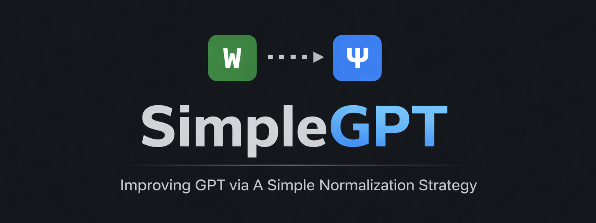
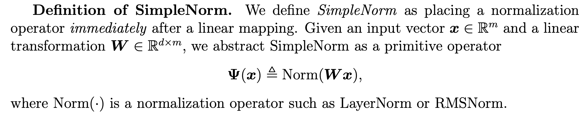
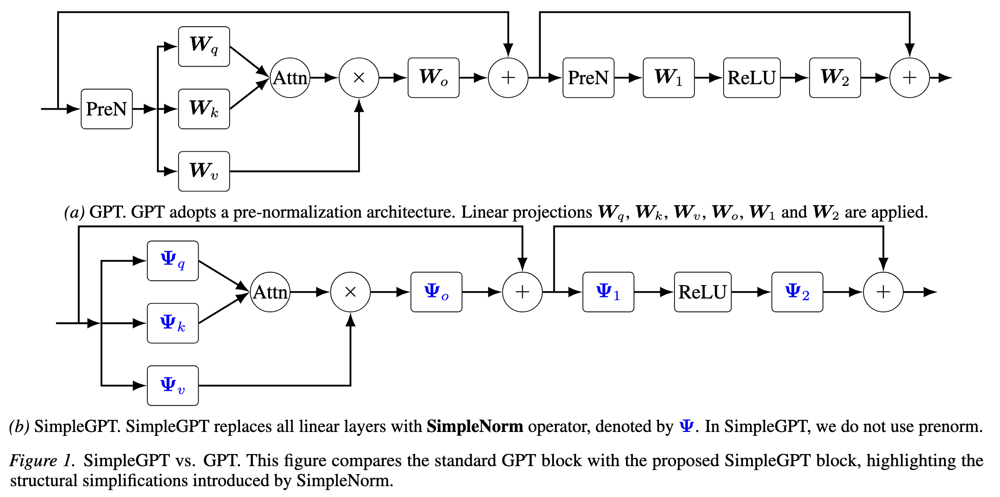
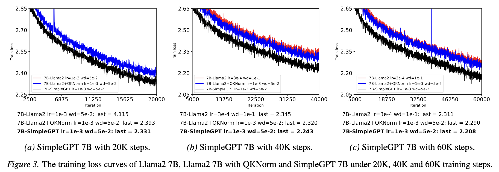

<div align="center">




[](https://arxiv.org/abs/2602.01212)
[](https://icml.cc/Downloads/2026)
[](LICENSE)
</div>

This repository provides a reference implementation of SimpleGPT, a novel architecture that explores a unified normalization strategy for Transformer-based large language models.

Instead of treating normalization as a special operation inserted at specific locations (e.g., pre-norm, post-norm, or QK-norm), SimpleGPT adopts **SimpleNorm**, a unified design principle in which **every affine (linear) transformation is immediately followed by normalization**.

We show that this simplification improves training stability, enables larger learning rates, and yields competitive or improved performance compared to standard GPT architectures, without significant overhead. Please refer to our paper [SimpleGPT: Improving GPT via a Simple Normalization Strategy](https://arxiv.org/abs/2602.01212) for more details.

## SimpleNorm and SimpleGPT Architecture

**Definition of SimpleNorm**  


**SimpleGPT architecture overview**  


**Training loss on Llama-7B**  


# Running the Code

## Setup

### Install dependencies

We use the [Torchtitan](https://github.com/pytorch/torchtitan) codebase to parallelize training. To run the code, please install dependencies with the following commands or refer to instructions from the official [Torchtitan](https://github.com/pytorch/torchtitan) repository.

```bash
git clone https://github.com/Ocram7/SimpleGPT
cd SimpleGPT/src
pip install -r requirements.txt
pip3 install --pre torch --index-url https://download.pytorch.org/whl/nightly/cu129 --force-reinstall # this is for cuda version 12.9. Please choose a version depending on your cuda installation 
pip3 install --pre torchdata --index-url https://download.pytorch.org/whl/nightly
```

### Download tokenizer

Our codebase currently implements variants of the Llama2 and Llama3 architecture. Please follow the instructions from the official [meta-llama](https://huggingface.co/meta-llama/Meta-Llama-3-8B) repository to ensure you have acces to the Llama model weights. Once you have confirmed access, you can run the following commands to download the Llama2 and Llama3 tokenizers to your local machine.

```
# Get your HF token from https://huggingface.co/settings/tokens

# llama3 tokenizer.model
python torchtitan/datasets/download_tokenizer.py --repo_id meta-llama/Meta-Llama-3-8B --tokenizer_path "original" --hf_token=...

# llama2 tokenizer.model
python torchtitan/datasets/download_tokenizer.py --repo_id meta-llama/Llama-2-13b-hf --hf_token=...
```

After downloading the tokenizers, please ensure that the `model.tokenizer_path` attribute in the toml configuration files points to your local tokenizer.

### Download dataset

If you wish to train on the C4 dataset, please download it from [https://huggingface.co/datasets/allenai/c4](https://huggingface.co/datasets/allenai/c4) and update the `training.dataset_path` attribute in the configuration files.

Please download the C4-mini dataset (download from [Google Drive](https://drive.google.com/drive/folders/1B16KpuhUyz4p7mwc9xmRHuyCY37dAw-2)) for validation. After downloading it, move it under `src/torchtitan/datasets/c4_mini`. Note that in our paper, we do not report validation loss for our Llama-based experiments, and only train using C4.

## Training SimpleGPT

To run the code on a single node, execute the [run.sh](src/run.sh) bash script with the desired config file as the first parameter:

```bash
./run.sh "train_configs/llama2_1B/simplegpt.toml"
```

### Config files

We include sample configuration files for variants of `llama2_1B`, `llama2_7B`, and `llama3_8B` in [train_configs](src/train_configs/). For each model scale, we provide three configs: standard prenorm-only Llama (`prenorm.toml`), Llama with prenorm and qknorm (`preqknorm.toml`), and Llama-based SimpleGPT (`simplegpt.toml`).

**Special configuration parameters**

| Parameter | Type | Description |
|---------|------|-------------|
| `model.name` | str | Architecture variant (`llama2`, `llama2_preqknorm`, `llama2_simplegpt`, `llama3`, `llama3_preqknorm`, `llama3_simplegpt`) |
| `model.tokenizer_path` | str | Path to local tokenizer |
| `training.dataset` | str | Dataset name (`c4`, `c4_mini`) |
| `training.dataset_path` | str | Path to dataset |

> **Note on hyperparameters:**  
> The sample configuration files are provided for ease of use and debugging, and may differ slightly from the hyperparameters reported in the paper. These differences do **not affect the conclusions** of the work. Please refer to the paper for exact settings.

# Changelog

1. [2026-05-01]: SimpleGPT accepted to ICML 2026!
1. [2026-03-01]: Initial code released!

## Acknowledgements

This codebase is heavily based on the implementations of [Torchtitan](https://github.com/pytorch/torchtitan) and [Adam-mini](https://github.com/zyushun/Adam-mini). We thank the authors of these projects for making their code publicly available.

**Note.** In our paper, we evaluate **SimpleGPT** on both Llama-based and nanoGPT-based
architectures. This repository contains only the code used for the
Llama-based experiments. The nanoGPT-based experiments were conducted using
the original nanoGPT codebase, available at <https://github.com/karpathy/nanoGPT>.

# License

This repository is released under the [BSD 3-Clause License](LICENSE). Portions of
the code are derived from Torchtitan and retain their original Meta copyright
notices and BSD 3-Clause license terms. See [src/LICENSE](src/LICENSE) for the
upstream Torchtitan license text.

# Citation

If you find our work useful, please cite:

```
@article{chen2026simplegpt,
  title={SimpleGPT: Improving GPT via A Simple Normalization Strategy},
  author={Chen, Marco and Qi, Xianbiao and He, Yelin and Ye, Jiaquan and Xiao, Rong},
  journal={arXiv preprint arXiv:2602.01212},
  year={2026}
}
```
